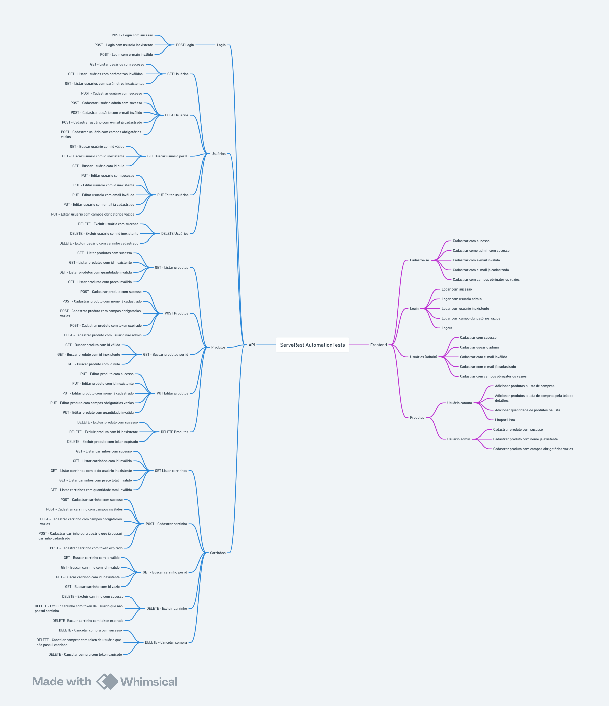

[](https://github.com/arthurxii/ServeRestAutomationTests/actions/workflows/workflow.yml)

## Descrição do projeto

Projeto de testes e2e automatizados para a aplicação frontend https://front.serverest.dev/ e testes automatizados para a API https://serverest.dev/

## Tecnologias Utilizadas
- Javascript
- Cypress
- Node.js
- Faker
- Mochawesome Reports

## Como executar 

1. Clonar o repositório e instalar as depências do projeto
```
git clone https://github.com/arthurxii/zombieplus-playwright-tests.git
```

```
npm install
```

2. Executar os testes em modo headless (Sem inteface gráfica do Cypress)
```
npx cypress run 
```
- Executar specs de teste específicas
```
npx cypress run --spec "cypress/tests/api/**/*.cy.js"
npx cypress run --spec "cypress/tests/e2e/**/*.cy.js"
```

3. Executar os testes com a interface gráfica do Cypress (Após abrir a interface, selecionar e2e Testing e o navegador preferido)
```
npx cypress open
```

## Cenários de teste

Segue abaixo o mapa mental com os cenários de teste (Obs: Para esse momento, foram automatizados os seguintes cenários:) 

- API (Endpoints):
  - Login: POST
  - Usuários: POST, GET, GET By ID, PUT e DELETE
  - Produtos: POST, GET, GET By ID, PUT e DELETE
- e2e (Funcionalidades):
  - Login e Logout
  - Cadastro de usuários e Cadastro de usuário logado como administrador
  - Cadastro de produtos e Adicionar produtos a lista de compras

<p align="center"></p>

Segue abaixo o vídeo da execução dos testes com a interface gráfica do cypress:

video

## CI/CD

Para esse projeto foi implementada a integração contínua com o GitHubActions, a partir do arquivo de configuração "arquivo". A cada vez que for realizado um push ou pull request na branch main do projeto, a pipeline é executada para garantir que a aplicação está funcionando corretamente.


